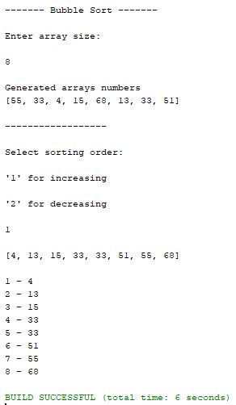
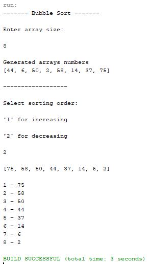

# Java basics
_Bubble sort_

This project is for Java learning and practicing only. 
During this project main aim to practice array sorting

 
This is a small program, which takes user input of array size (amount of numbers in array)
and generates random numbers.

The generated arrays is displayed.

User can choose sorting order:

 - Increasing

 - Decreasing

## Project goals

-   Any size array defined by user
-   Generate random numbers to array (0-100)
-   Two sorting orders

## Authors

[Vadim](https://github.com/vadimmozeiko)
